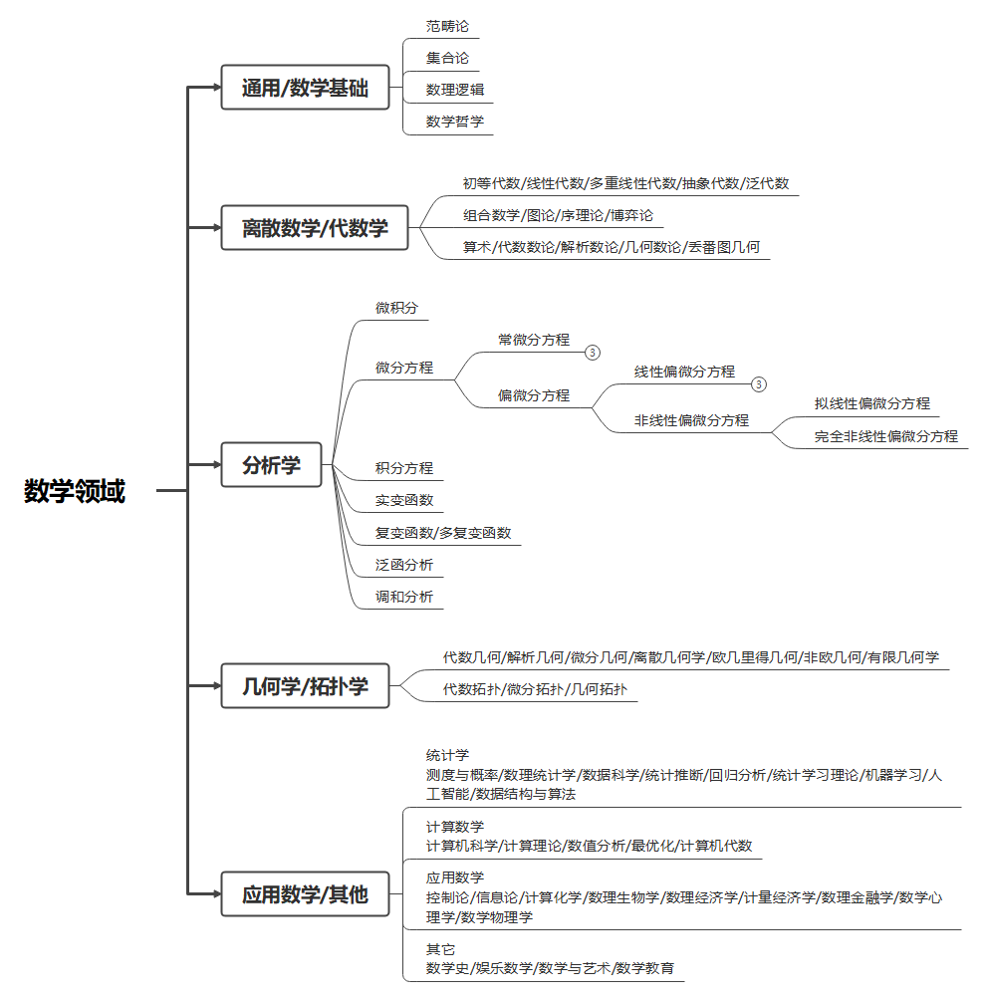
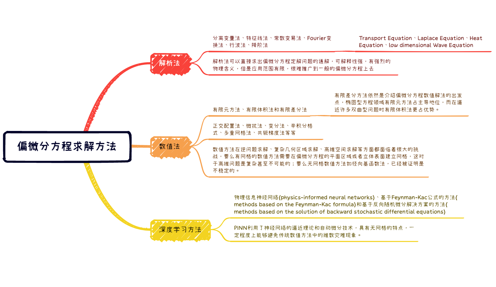
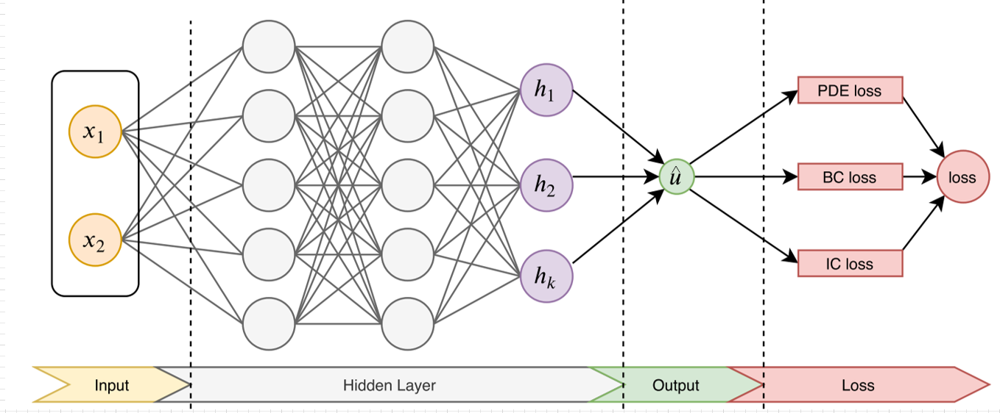
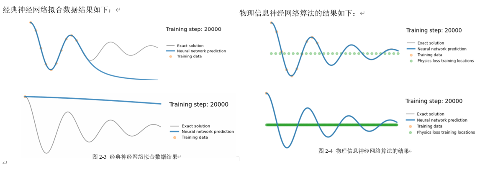

# DeepXDE and PINN

使用物理信息神经网络(Physics Informed Neural Networks, PINNs)解微分方程。

### Notebook

[环境配置](1环境配置.ipynb) 

[微分方程简介](99微分方程简介.ipynb) [什么是PINN](2什么是PINN.ipynb) [物理信息神经网络简介](99物理信息神经网络简介.ipynb) 

[逼近函数](2用神经网络逼近任意函数.ipynb) 

[解常微分方程](3常微分方程ODE.ipynb) 

[解线性偏微分方程](4四大线性偏微分方程.ipynb) 

[解非线性偏微分方程](5非线性偏微分方程.ipynb) 

[解高维偏微分方程](6高维偏微分方程.ipynb)

[解分数阶偏微分方程](7分数阶偏微分方程.ipynb) 

### PINNs-master

https://github.com/maziarraissi/PINNs

### assets

一些文件

### 公式显示异常

GitHub 的 markdown 渲染是不支持公式的，所以公式如果不能正常显示，是正常现象。

谷歌浏览器可以安装插件[MathJax Plugin for Github](https://chrome.google.com/webstore/detail/mathjax-plugin-for-github/ioemnmodlmafdkllaclgeombjnmnbima)，[MathJax 3 Plugin for Github](https://chrome.google.com/webstore/detail/mathjax-3-plugin-for-gith/peoghobgdhejhcmgoppjpjcidngdfkod) 或者 [GitHub Math Display](https://chrome.google.com/webstore/detail/github-math-display/cgolaobglebjonjiblcjagnpmdmlgmda)，可以正常显示大部分公式。

